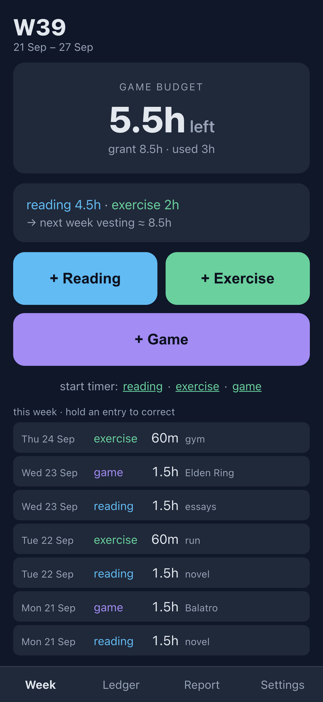
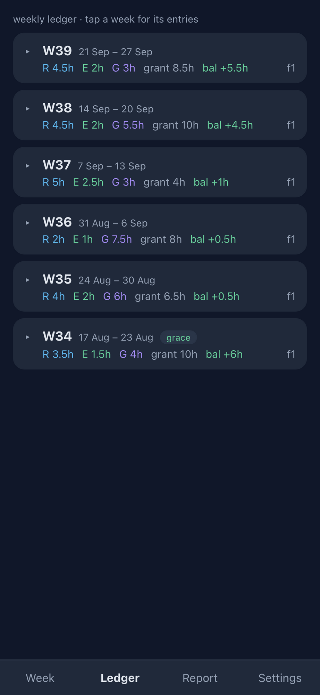
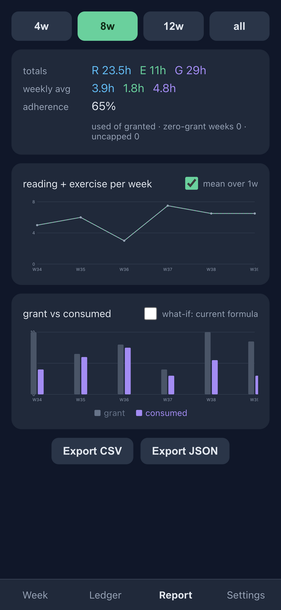
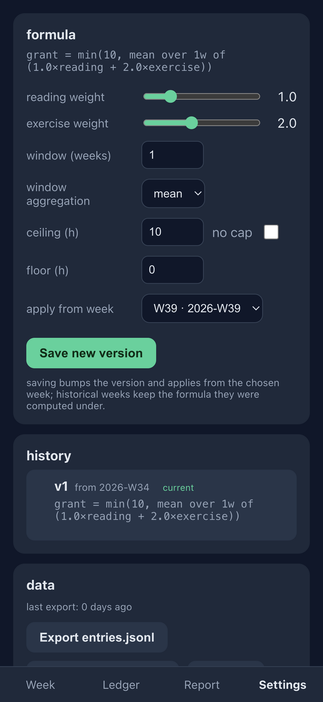

# Vested

> You don't get game time. You vest it.

Next week's gaming budget is earned by this week's reading and exercise. Vested is a tiny, offline-first PWA that keeps exactly one feedback loop: log hours in three categories, and a user-definable formula computes how much game time the coming week grants. No accounts, no backend, no streaks, no enforcement — the tool informs, you decide.

**Live app → [zhengfeiwang.github.io/vested](https://zhengfeiwang.github.io/vested/)**
On iOS: open in Safari → Share → *Add to Home Screen*. Works fully offline after the first load.

| This Week | Ledger | Report | Settings |
|---|---|---|---|
|  |  |  |  |

## The rule

Let `R(w)`, `E(w)` be hours of reading and exercise in week `w` (ISO week, Monday start). The grant for the next week comes from a sliding window over the N most recent completed weeks:

```
grant(w+1) = clamp( floor, ceiling,
                    aggregate over window(w) of
                    ( weight_reading × R + weight_exercise × E ) )
```

| Parameter | Default | Meaning |
|---|---|---|
| `weights.reading` | 1.0 | reading hours convert 1:1 |
| `weights.exercise` | 2.0 | exercise is harder to motivate, so it pays double |
| `window.weeks` | 1 | "next week ≤ last week"; raise to 2–3 to smooth travel/sick weeks |
| `ceilingHours` | 10 | hard cap (`null` = uncapped "trust week") |
| `floorHours` | 0 | minimum grant even after a zero week |

The formula is **data, not code**: a versioned config object with an `effectiveFrom` week. Edits bump the version; historical weeks keep the formula they were computed under, and the report can recompute any range under the current formula ("what if").

Edge cases, decided upfront: the first week is a grace week (grant = ceiling); empty weeks count as 0; overdrawing is recorded as debt, never blocked; unspent grant does not roll over; retroactive logging is allowed into any past date (entries carry `loggedAt` separate from `date`); corrections are append-only compensating entries.

Full spec with rationale: [docs/prd.md](docs/prd.md).

## Data: yours, readable, durable

- Everything lives in **IndexedDB, local to that browser on that device**. No sync in v1.
- Event-sourced and append-only: entries are truth; the ledger is a derived view recomputed on read, so formula changes recompute history cleanly.
- Backup is manual and git-friendly: **Settings → Export** produces `entries.jsonl` + `formulas.jsonl` (one record per line, header with `schemaVersion`, deterministic ordering for minimal diffs). Import validates every line, then **merges** into (union by `id`/`version`) or **fully replaces** the matching dataset — your choice, with counts shown upfront.
- The main screen quietly shows "last export: N days ago" once you pass 7 days without a backup.

## Tech

TypeScript single-page app with **zero runtime dependencies** — no framework, hand-rolled DOM helpers and SVG charts. Vite 8 build, `vite-plugin-pwa` for the offline service worker and installable manifest. ~11 KB gzip.

```
src/
  weeks.ts      ISO 8601 week math (53-week years included)
  formula.ts    grant computation, validation, human-readable rendering
  ledger.ts     entries → weekly ledgers (derived, never stored)
  db.ts         minimal IndexedDB promise wrapper
  store.ts      in-memory state, write-through persistence, pub/sub
  transfer.ts   JSONL export / validated full-replace import
  ui/           screens: week, ledger, report, settings (+ charts, dom helpers)
```

## Develop

```sh
npm install
npm run dev        # dev server
npm run build      # typecheck + production build
npm run preview    # serve the build locally
npm run icons      # regenerate PWA icons (scripts/icons.mjs, zero deps)
```

Deployment: every push to `main` builds and publishes to GitHub Pages via `.github/workflows/deploy.yml`. The site is served from the `/vested/` subpath, so the production `base` is `/vested/` (dev uses `/`). Note that `vite preview` serves the build at root regardless of `base` — for a local production check, build with `npx vite build --base=/` first.

## License

[MIT](LICENSE)
